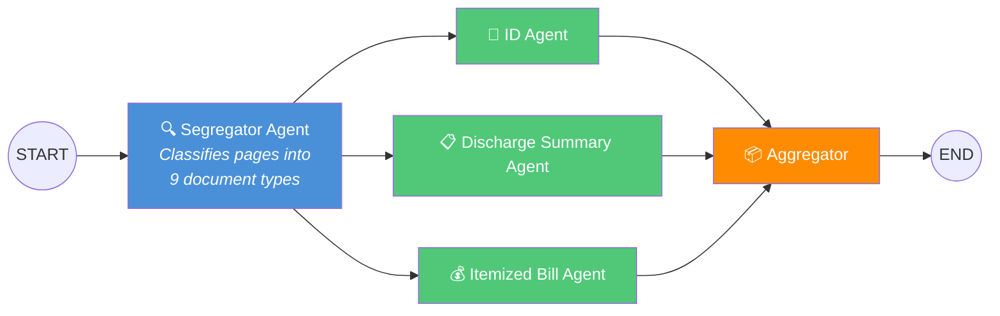

# 🏥 Claim Processing Pipeline


An AI-powered **FastAPI** service that processes PDF insurance claims using **LangGraph** to orchestrate document segregation and multi-agent extraction with **Google Gemini**.

---

## 📐 Architecture

```
START → [Segregator Agent (AI)] → [ID Agent]                → [Aggregator] → END
                                → [Discharge Summary Agent]  ↗
                                → [Itemized Bill Agent]      ↗
```



### Pipeline Flow

1. **Segregator Agent** (AI-powered) — Takes the full PDF, renders each page as a 200 DPI image, and uses Gemini vision to classify every page into one of **9 document types**:

   `claim_forms` · `cheque_or_bank_details` · `identity_document` · `itemized_bill` · `discharge_summary` · `prescription` · `investigation_report` · `cash_receipt` · `other`

2. **Extraction Agents** (3 parallel agents) — Each receives **only** the pages assigned to them by the segregator (not the whole PDF):
   | Agent | Input Pages | Extracts |
   |-------|-------------|----------|
   | **ID Agent** | `identity_document`, `claim_forms` | Patient name, DOB, ID numbers, policy details |
   | **Discharge Summary Agent** | `discharge_summary` | Diagnosis, admit/discharge dates, physician details, medications |
   | **Itemized Bill Agent** | `itemized_bill` | All line items with costs, calculates total amount |

3. **Aggregator Node** — Combines all agent results into a unified JSON response

---

## 🛠 Tech Stack

| Component | Technology |
|-----------|-----------|
| API Framework | [FastAPI](https://fastapi.tiangolo.com/) |
| Workflow Orchestration | [LangGraph](https://langchain-ai.github.io/langgraph/) |
| LLM | [Google Gemini 2.0 Flash](https://ai.google.dev/) (multimodal vision) |
| PDF Processing | [PyMuPDF](https://pymupdf.readthedocs.io/) |
| Data Validation | [Pydantic v2](https://docs.pydantic.dev/) |
| LLM Integration | [LangChain](https://python.langchain.com/) |

---

## 📁 Project Structure

```
├── app/
│   ├── __init__.py
│   ├── main.py                # FastAPI app & POST /api/process endpoint
│   ├── config.py              # Environment variables & settings
│   ├── models.py              # Pydantic schemas for all pipeline data
│   ├── workflow.py            # LangGraph graph definition (fan-out/fan-in)
│   ├── llm.py                 # Gemini multimodal wrapper (text + images)
│   ├── pdf_utils.py           # PDF page → base64 image conversion
│   └── agents/
│       ├── __init__.py
│       ├── segregator.py      # AI page classifier (9 document types)
│       ├── id_agent.py        # Identity & policy data extractor
│       ├── discharge_agent.py # Discharge summary extractor
│       └── bill_agent.py      # Itemized bill & line item extractor
├── generate_test_pdf.py       # Script to create a sample 12-page test PDF
├── test_api.py                # API test client
├── requirements.txt
├── Dockerfile
├── .env.example
├── .gitignore
├── LICENSE
└── README.md
```

---

## 🚀 Setup & Installation

### Prerequisites

- **Python 3.11+**
- **Google Gemini API key** → [Get one free here](https://aistudio.google.com/apikey)

### Quick Start

```bash
# 1. Clone the repository
git clone https://github.com/<your-username>/claim-processing-pipeline.git
cd claim-processing-pipeline

# 2. Create & activate virtual environment
python -m venv venv
source venv/bin/activate        # Linux / macOS
# venv\Scripts\activate         # Windows

# 3. Install dependencies
pip install -r requirements.txt

# 4. Configure environment
cp .env.example .env
# Edit .env → add your GOOGLE_API_KEY

# 5. Start the server
uvicorn app.main:app --reload --port 8000
```

The API will be live at **http://localhost:8000**.

### Interactive API Docs

| Interface | URL |
|-----------|-----|
| Swagger UI | http://localhost:8000/docs |
| ReDoc | http://localhost:8000/redoc |

---

## 📡 API Usage

### `POST /api/process`

Process a PDF claim document through the AI pipeline.

**Request** — `multipart/form-data`:

| Field | Type | Required | Description |
|-------|------|----------|-------------|
| `claim_id` | `string` | ✅ | Unique claim identifier |
| `file` | `file` | ✅ | PDF claim document (max 50 MB) |

#### cURL

```bash
curl -X POST http://localhost:8000/api/process \
  -F "claim_id=CLM-2025-001" \
  -F "file=@/path/to/claim.pdf"
```

#### Python

```python
import requests

response = requests.post(
    "http://localhost:8000/api/process",
    data={"claim_id": "CLM-2025-001"},
    files={"file": open("claim.pdf", "rb")},
)
print(response.json())
```

#### Sample Response

```json
{
  "claim_id": "CLM-2025-001",
  "status": "success",
  "segregation": {
    "total_pages": 5,
    "page_groups": {
      "identity_document": [1],
      "discharge_summary": [2, 3],
      "itemized_bill": [4, 5]
    },
    "classifications": [
      { "page_number": 1, "document_type": "identity_document", "confidence": 0.95 },
      { "page_number": 2, "document_type": "discharge_summary", "confidence": 0.92 },
      { "page_number": 3, "document_type": "discharge_summary", "confidence": 0.88 },
      { "page_number": 4, "document_type": "itemized_bill", "confidence": 0.97 },
      { "page_number": 5, "document_type": "itemized_bill", "confidence": 0.91 }
    ]
  },
  "extracted_data": {
    "identity_information": {
      "patient_name": "John Michael Smith",
      "date_of_birth": "1985-03-15",
      "id_number": "ID-987-654-321",
      "policy_number": "POL-987654321"
    },
    "discharge_summary": {
      "admission_date": "2025-01-20",
      "discharge_date": "2025-01-25",
      "primary_diagnosis": "Community Acquired Pneumonia",
      "treating_physician": "Dr. Sarah Johnson, MD"
    },
    "itemized_bill": {
      "items": [
        { "description": "Room Charges - Semi-Private (5 days)", "quantity": 5, "unit_price": 200.00, "amount": 1000.00 },
        { "description": "Emergency Room Services", "quantity": 1, "unit_price": 500.00, "amount": 500.00 },
        { "description": "CT Scan - Chest", "quantity": 1, "unit_price": 800.00, "amount": 800.00 }
      ],
      "total_amount": 6418.65
    }
  },
  "errors": []
}
```

---

## 🧪 Testing

A test PDF generator and API client are included:

```bash
# Generate a 12-page sample claim PDF
python generate_test_pdf.py

# Run the test client (server must be running)
python test_api.py
```

The generated PDF includes pages for all 9 document types: claim form, bank details, government ID, discharge summary, prescription, lab reports, cash receipt, registration form, and itemized bills.

---

## 🐳 Deployment

### Docker

```bash
docker build -t claim-pipeline .
docker run -p 8000:8000 -e GOOGLE_API_KEY=your_key claim-pipeline
```

### Render

1. Connect your GitHub repo to [Render](https://render.com)
2. Set environment to **Docker**
3. Add `GOOGLE_API_KEY` as an environment variable
4. Deploy

### Railway

```bash
railway login
railway init
railway variables set GOOGLE_API_KEY=your_key_here
railway up
```

---

## 🔍 How It Works

### 1. Segregator Agent (AI-powered)

The segregator renders each page of the uploaded PDF as a high-resolution image (200 DPI) using PyMuPDF. Each page image is sent **individually** to Gemini with a structured prompt asking for classification into one of 9 document types. The model returns a JSON object with:
- `document_type` — the classified category
- `confidence` — a 0–1 score
- `reasoning` — one-sentence explanation

Pages are then **grouped by type** into a routing map (e.g., `{ "identity_document": [3], "itemized_bill": [9, 10] }`).

### 2. Extraction Agents (Parallel)

After segregation, pages are **routed only to their relevant agent** — no agent receives the entire PDF:

- **ID Agent** → Receives `identity_document` + `claim_forms` pages. Extracts patient demographics, ID numbers, and policy information.
- **Discharge Summary Agent** → Receives `discharge_summary` pages. Extracts clinical data including diagnosis, dates, procedures, and medications.
- **Itemized Bill Agent** → Receives `itemized_bill` pages. Extracts every line item with amounts and auto-calculates the total if missing.

All three agents run **in parallel** via LangGraph's fan-out/fan-in edges, significantly reducing total processing time.

### 3. Aggregator

Combines outputs from all agents into a single structured JSON response containing:
- Segregation metadata (page classifications + groupings)
- Extracted data from all three agents
- Any errors encountered during processing

### Key Design Decisions

| Decision | Rationale |
|----------|-----------|
| **Gemini Vision** for classification | Handles scanned PDFs, handwritten forms, and complex layouts without OCR preprocessing |
| **Per-page classification** | More accurate than whole-document classification; each page gets focused attention |
| **Selective page routing** | Agents receive only relevant pages as images — reduces token usage and improves accuracy |
| **Parallel extraction** | Fan-out/fan-in via LangGraph edges — 3 agents run concurrently |
| **Graceful error handling** | Individual agent failures don't crash the pipeline; errors are collected and returned |
| **Auto-total calculation** | Bill Agent computes total from line items if the LLM doesn't provide one |

---

## 📄 Environment Variables

| Variable | Required | Default | Description |
|----------|----------|---------|-------------|
| `GOOGLE_API_KEY` | ✅ | — | Google Gemini API key |
| `GEMINI_MODEL` | ❌ | `gemini-2.0-flash` | Gemini model to use |
| `UPLOAD_DIR` | ❌ | `uploads` | Temporary upload directory |
| `MAX_FILE_SIZE_MB` | ❌ | `50` | Maximum upload size in MB |

---

## 📜 License

This project is licensed under the [MIT License](LICENSE).
